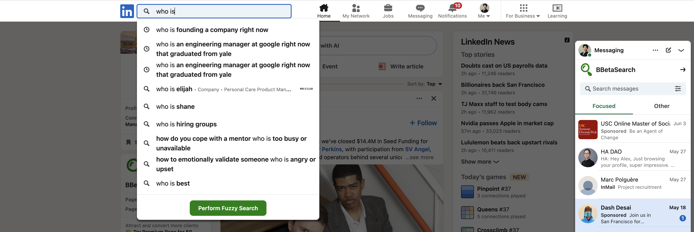

# Linkedin NLP Search

## Features

This is a lightweight Chrome Extension that allows for natural language search on the Linkedin website. Simply input a prompt in the search bar and click the green "Perform Fuzzy Search" button. You also have the option of not using fuzzy search and further tuning your results by just searching as you normally would.



## Installing and Running

### Procedures:

1. Check if your [Node.js](https://nodejs.org/) version is >= **18** (you can run `node -v`).
2. Clone this repository.
5. Run `npm install` to install the dependencies.
6. Run `npm start`
7. Load your extension on Chrome following:
   1. Access `chrome://extensions/`
   2. Check `Developer mode`
   3. Click on `Load unpacked extension`
   4. Select the `build` folder.
8. Pin the extension into your Chrome header.
9. Input your OpenAI API key into the settings when you click on the extension icon.
9. Feel free to stop the `npm start` command that was running before.
10. Enjoy!

## Technology

This extension uses OpenAI's function calling capabilities to extract filters from the user's prompt. These filters include education, company, names, and important keywords. The filters are then applied to a Linkedin search through url, and finally displayed to the user. 

### Why we used this approach

Before this method was employed, previous attempts to create a fuzzy search bar proved to be very challenging. Originally, I intended to fetch all a person's first connections, extract profile data (using the Linkedin API), and encode profiles in vector embeddings so that similarity search could be employed. However, Linkedin's API is quite nonfunctional, outdated, and requires permissions from a developer program that does not actually exist (see [this article](https://ethansk.medium.com/do-not-use-the-linkedin-api-e4cea9649115)). And so, the API was out of question. 

Next, we tried getting data directly from their site or simulating user actions through Linkedin's Voyager API, which doesn't require weird permissioning. However, I managed to get three of my Linkedin accounts (two of them dummy accounts) restricted for an hour because they detected "automation". Upon further research, it was discovered that Linkedin has a hard set limit of 80 profile viewings per day, and if you view them too fast, you're also a bot. In other words, profile data could not be fetched from Linkedin, so I needed to turn to 3rd party services.

There are a number of 3rd party services out there, Proxycurl, People Data Labs, and Coresignal to name a few. However, I quickly realized, that while these products did work, they were quite pricey. If you were to fetch data from all your 1200 connections, if would have costed ~120 dollars. Thus, outside services were out of the question as well. Therefore, we turned to filters—improving on Linkedin's already existing natural language capabilities (which are not great). 

## Personal Notes: Packing

Run the command

```
$ NODE_ENV=production npm run build
```

Now, the content of `build` folder will be the extension ready to be submitted to the Chrome Web Store. Just take a look at the [official guide](https://developer.chrome.com/webstore/publish) to more infos about publishing.


## Author

Alex Sima | [Linkedin haha](https://www.linkedin.com/in/sima-alex/)
